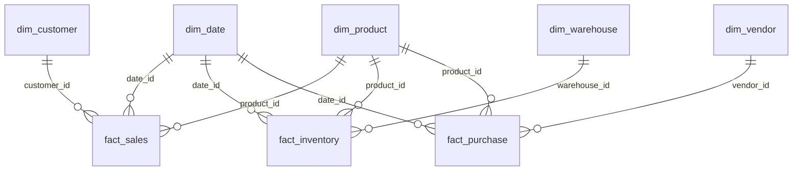

# ERD Star Schema (Blueprint)

```mermaid
erDiagram
    dim_date ||--o{ fact_sales : "date_id"
    dim_product ||--o{ fact_sales : "product_id"
    dim_customer ||--o{ fact_sales : "customer_id"
    
    dim_date ||--o{ fact_inventory : "date_id"
    dim_product ||--o{ fact_inventory : "product_id"
    dim_warehouse ||--o{ fact_inventory : "warehouse_id"

    dim_date ||--o{ fact_purchase : "date_id"
    dim_vendor ||--o{ fact_purchase : "vendor_id"
    dim_product ||--o{ fact_purchase : "product_id"
```
