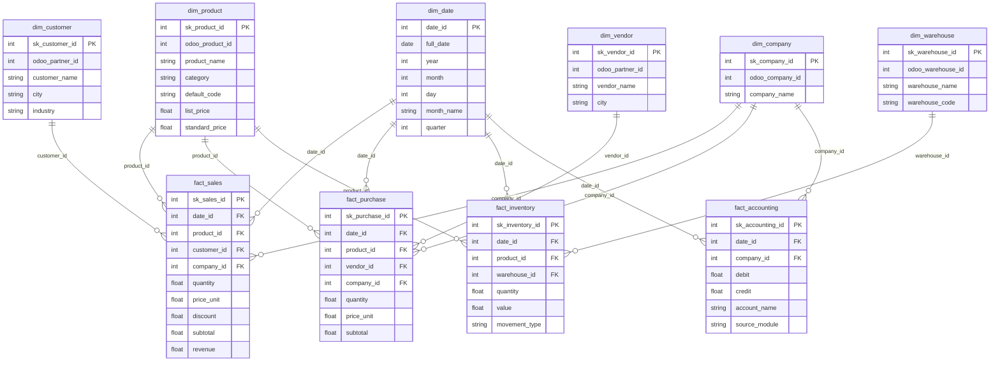

# ERD Star Schema

## Analytics Mart — Star Schema (Kimball)

```mermaid
erDiagram
    dim_date ||--o{ fact_sales : "date_id"
    dim_product ||--o{ fact_sales : "product_id"
    dim_customer ||--o{ fact_sales : "customer_id"
    dim_company ||--o{ fact_sales : "company_id"

    dim_date ||--o{ fact_purchase : "date_id"
    dim_product ||--o{ fact_purchase : "product_id"
    dim_vendor ||--o{ fact_purchase : "vendor_id"
    dim_company ||--o{ fact_purchase : "company_id"

    dim_date ||--o{ fact_inventory : "date_id"
    dim_product ||--o{ fact_inventory : "product_id"
    dim_warehouse ||--o{ fact_inventory : "warehouse_id"

    dim_date ||--o{ fact_accounting : "date_id"
    dim_company ||--o{ fact_accounting : "company_id"

    fact_sales {
        int sk_sales_id PK
        int date_id FK
        int product_id FK
        int customer_id FK
        int company_id FK
        float quantity
        float price_unit
        float discount
        float subtotal
        float revenue
    }

    fact_purchase {
        int sk_purchase_id PK
        int date_id FK
        int product_id FK
        int vendor_id FK
        int company_id FK
        float quantity
        float price_unit
        float subtotal
    }

    fact_inventory {
        int sk_inventory_id PK
        int date_id FK
        int product_id FK
        int warehouse_id FK
        float quantity
        float value
        string movement_type
    }

    fact_accounting {
        int sk_accounting_id PK
        int date_id FK
        int company_id FK
        float debit
        float credit
        string account_name
        string source_module
    }

    dim_date {
        int date_id PK
        date full_date
        int year
        int month
        int day
        string month_name
        int quarter
    }

    dim_product {
        int sk_product_id PK
        int odoo_product_id
        string product_name
        string category
        string default_code
        float list_price
        float standard_price
    }

    dim_customer {
        int sk_customer_id PK
        int odoo_partner_id
        string customer_name
        string city
        string industry
    }

    dim_vendor {
        int sk_vendor_id PK
        int odoo_partner_id
        string vendor_name
        string city
    }

    dim_company {
        int sk_company_id PK
        int odoo_company_id
        string company_name
    }

    dim_warehouse {
        int sk_warehouse_id PK
        int odoo_warehouse_id
        string warehouse_name
        string warehouse_code
    }
```
