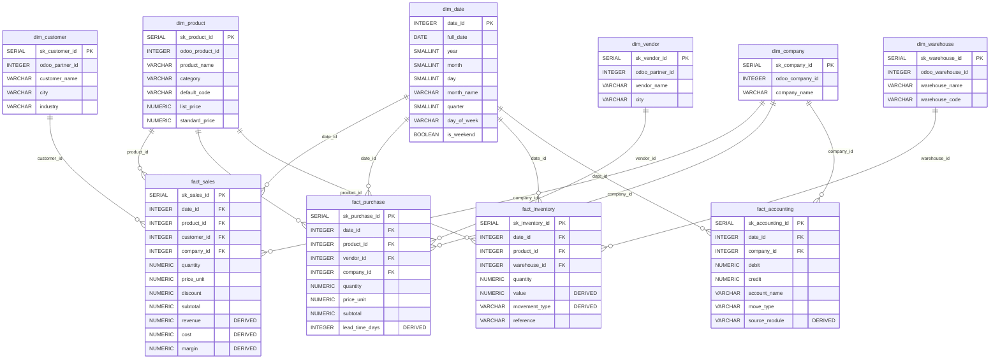

# Star Schema Final

## Final Star Schema — Analytics Mart (schema: mart)

## Relationship Summary (13 FK)

| # | Fact | FK Column | Dim | PK Column | Cardinality |
| :---: | :--- | :--- | :--- | :--- | :--- |
| 1 | fact_sales | date_id | dim_date | date_id | N:1 |
| 2 | fact_sales | product_id | dim_product | sk_product_id | N:1 |
| 3 | fact_sales | customer_id | dim_customer | sk_customer_id | N:1 |
| 4 | fact_sales | company_id | dim_company | sk_company_id | N:1 |
| 5 | fact_purchase | date_id | dim_date | date_id | N:1 |
| 6 | fact_purchase | product_id | dim_product | sk_product_id | N:1 |
| 7 | fact_purchase | vendor_id | dim_vendor | sk_vendor_id | N:1 |
| 8 | fact_purchase | company_id | dim_company | sk_company_id | N:1 |
| 9 | fact_inventory | date_id | dim_date | date_id | N:1 |
| 10 | fact_inventory | product_id | dim_product | sk_product_id | N:1 |
| 11 | fact_inventory | warehouse_id | dim_warehouse | sk_warehouse_id | N:1 |
| 12 | fact_accounting | date_id | dim_date | date_id | N:1 |
| 13 | fact_accounting | company_id | dim_company | sk_company_id | N:1 |

## Catatan untuk Power BI
- Power BI akan auto-detect relationship berdasarkan nama kolom yang sama (date_id, product_id, dsb).
- Semua relationship bertipe **Many-to-One** (Fact → Dimension).
- Tidak ada relationship Fact-to-Fact (sesuai Kimball).
- Cross-filter direction: **Single** (dari Dimension ke Fact).
