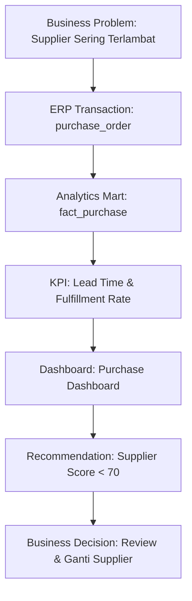
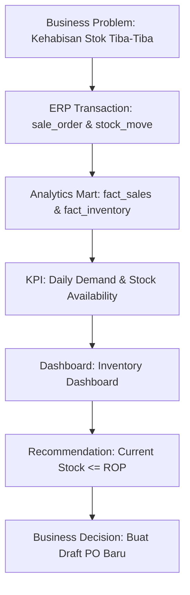
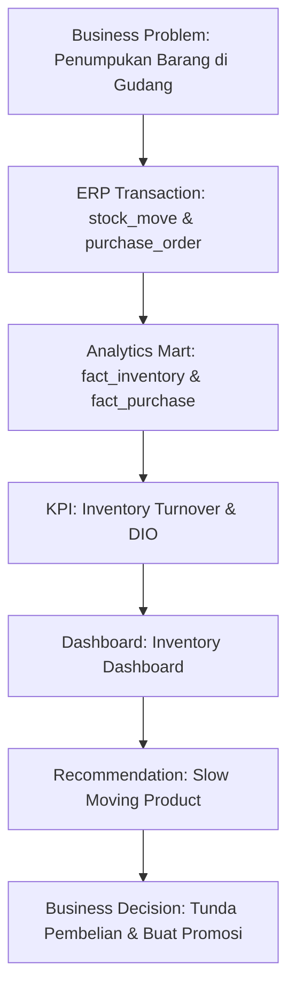
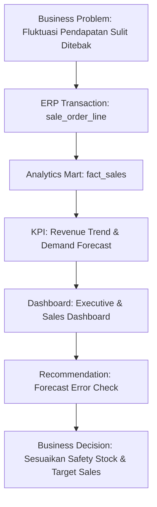

# Business Traceability Matrix

Matriks ini memastikan setiap elemen Business Intelligence (Dashboard, KPI, Rekomendasi) dapat dilacak balik (*traceable*) secara eksplisit mulai dari masalah bisnis yang mendasarinya, transaksi sistem ERP yang merekamnya, hingga keputusan manajerial yang harus diambil. 

Ini adalah penghubung utama antara **Product 1 (Laporan Implementasi ERP)** dan **Product 2 (Business Intelligence)**.

## 1. Flow: Mengatasi Keterlambatan Rantai Pasok

## 2. Flow: Mencegah Kehabisan Stok (Stockout)

## 3. Flow: Mengatasi Penumpukan Barang (Overstock)

## 4. Flow: Memprediksi Permintaan Pasar

---

## Analisis Lapisan (Layer Analysis)

Traceability Matrix di atas menegaskan pembagian kerja teknis yang telah kita terapkan:

1. **ERP Output (Odoo) $\rightarrow$ ETL Output (Analytics Mart):**
   *(Phase 5 - Data Engineering)* Mengekstrak transaksi *raw* Odoo menjadi struktur *Fact* dan *Dimension*.
2. **Algoritma / Rekomendasi (DSS):**
   *(Phase 6 - Python Analytics)* Menghitung logika *prescriptive* (EOQ, ROP, MA3, Supplier Score). Parameter tingkat lanjut yang terlalu berat jika dihitung secara dinamis hanya menggunakan rumus BI biasa.
3. **Dashboard & KPI Dasar:**
   *(Phase 7 - Power BI)* Menyajikan agregasi visual interaktif (Sales, Growth, Margin) melalui DAX untuk konsumsi manajemen puncak.
