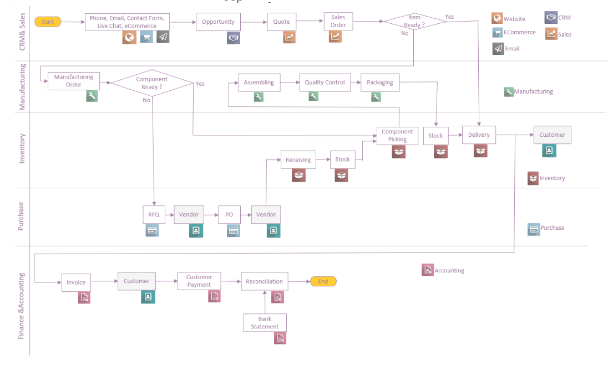

# Enterprise Business Intelligence & Decision Support System (ERP-BIDSS)

Enterprise Business Intelligence & Decision Support System (ERP-BIDSS) merupakan implementasi sistem Business Intelligence berbasis Odoo ERP yang mengintegrasikan proses bisnis operasional dengan analisis data menggunakan PostgreSQL, Python, dan Microsoft Power BI.

Proyek ini dikembangkan untuk membangun alur data end-to-end, mulai dari simulasi proses bisnis ERP, pembentukan data warehouse, ETL pipeline, hingga dashboard analitik yang mendukung pengambilan keputusan pada aktivitas penjualan, pembelian, persediaan, dan akuntansi.

---

# Project Overview

Sistem ERP mampu mencatat transaksi operasional secara lengkap, namun kebutuhan analisis strategis sering kali memerlukan proses pengolahan data tambahan agar informasi dapat digunakan sebagai dasar pengambilan keputusan.

Pada proyek ini dibangun sebuah arsitektur Business Intelligence yang memisahkan database operasional dengan data warehouse analitik sehingga proses pelaporan tidak membebani sistem ERP.

Implementasi meliputi:

- ERP Business Process (Purchase, Sales, Inventory, Accounting)
- Business Requirement Analysis
- Gap Requirement Analysis
- Data Simulation
- ETL Pipeline
- Star Schema Data Warehouse
- Business Intelligence Dashboard
- Decision Support System (Dvid)
- Power BI Dashboard

---

# System Architecture

## Business Process



Diagram di atas menunjukkan alur proses bisnis utama yang diimplementasikan pada Odoo mulai dari proses pembelian hingga penjualan serta integrasi antar modul ERP.

---

## Requirement Gathering


Tahap awal proyek dilakukan melalui identifikasi kebutuhan pengguna dan pemetaan proses bisnis sebagai dasar implementasi sistem ERP.

---

## Gap Requirement menuju Go-Live


Seluruh kebutuhan bisnis dibandingkan dengan proses standar Odoo untuk menentukan konfigurasi yang diperlukan sebelum implementasi Go-Live.

---

## Business Scenario


Dataset dikembangkan menggunakan skenario bisnis selama satu tahun untuk menghasilkan variasi kondisi operasional yang mendukung proses analisis Business Intelligence.

Skenario meliputi:

- Normal Operation
- Supplier Delay
- Emergency Purchase
- Inventory Recovery
- Overstock
- Stabilization

Pendekatan ini menghasilkan data yang lebih realistis dibandingkan penggunaan dataset acak.

---

## Enterprise Data Warehouse


Arsitektur data menggunakan pendekatan **Star Schema** yang terdiri atas tabel dimensi dan tabel fakta sehingga proses analisis Power BI menjadi lebih efisien.

Fact Table

- Fact Sales
- Fact Purchase
- Fact Inventory
- Fact Accounting
- Fact Decision Support
- Fact Supplier Score

Dimension Table

- Date
- Product
- Customer
- Vendor
- Warehouse

---

# Technology Stack

### ERP

- Odoo 18

### Database

- PostgreSQL

### Programming Language

- Python

### Data Engineering

- Pandas
- SQL
- psycopg2

### Business Intelligence

- Microsoft Power BI

### Version Control

- Git
- GitHub

---

# Project Workflow

```text
Requirement Analysis
        │
        ▼
Business Process Mapping
        │
        ▼
ERP Configuration
        │
        ▼
Business Scenario Simulation
        │
        ▼
Transaction Generation
        │
        ▼
ETL Pipeline
        │
        ▼
Data Warehouse (Star Schema)
        │
        ▼
Business Intelligence
        │
        ▼
Decision Support System
        │
        ▼
Power BI Dashboard
```

---

# Main Features

## ERP Implementation

- Purchase Management
- Sales Management
- Inventory Management
- Accounting Integration
- Cross Module Validation

## Data Engineering

- Automated Dataset Generation
- ETL Pipeline
- Data Cleaning
- Data Transformation
- Star Schema Modeling

## Business Intelligence

- Executive Dashboard
- Sales Dashboard
- Purchase Dashboard
- Inventory Dashboard
- Forecast Dashboard
- Decision Dashboard

## Decision Support

- Economic Order Quantity (EOQ)
- Reorder Point (ROP)
- Safety Stock
- Supplier Performance Score
- Inventory Recommendation
- Purchase Recommendation

---

# Dashboard Capabilities

The dashboard provides business insight through several analytical perspectives:

- Revenue Analysis
- Purchase Analysis
- Inventory Analysis
- Customer Analysis
- Vendor Analysis
- Product Performance
- Lead Time Analysis
- Forecast Analysis
- Decision Recommendation

---

# Repository Structure

```text
ERP-BIDSS
│
├── analytics/
├── business_intelligence/
├── datasets/
│   └── simulation/
├── database/
│   └── erd/
├── docs/
├── etl/
├── odoo_addons/
├── powerbi/
├── scripts/
├── sql/
└── README.md
```

---

# Learning Outcomes

Selama pengembangan proyek ini dilakukan implementasi berbagai kompetensi, antara lain:

- Business Process Analysis
- ERP Implementation
- Requirement Engineering
- ERP Validation
- Data Engineering
- Data Warehouse Design
- ETL Development
- SQL Programming
- Python Automation
- Business Intelligence
- Dashboard Development
- Decision Support System Design

---

# Output

Implementasi menghasilkan sebuah ekosistem Business Intelligence yang menghubungkan sistem ERP dengan dashboard analitik sehingga data operasional dapat diolah menjadi informasi yang mendukung proses pengambilan keputusan.

Proyek ini mencakup keseluruhan proses mulai dari analisis kebutuhan, konfigurasi ERP, simulasi data transaksi, pembangunan data warehouse, pengembangan ETL, hingga visualisasi interaktif menggunakan Microsoft Power BI.
