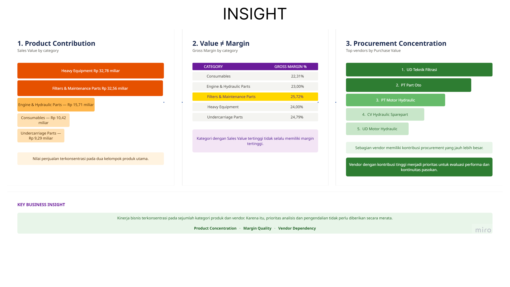

# Odoo Business Intelligence Decision Support System

**OBIDSS — Odoo Business Intelligence Decision Support System** adalah project end-to-end untuk mengubah transaksi operasional pada **Odoo 18 ERP** menjadi analytical data model, business insight, statistical forecasting, dan inventory decision support.

Project ini dibangun untuk mengeksplorasi satu pertanyaan utama:

> **Bagaimana data ERP dapat dikembangkan dari sekadar pencatatan transaksi menjadi informasi yang mendukung keputusan bisnis?**

Arsitektur project menghubungkan:

**Odoo 18 → PostgreSQL → Python ETL → Dimensional Data Mart → Forecasting & Decision Support → Power BI**

Project menggunakan skenario ERP sintetis yang reproducible sehingga proses ETL, analytical modeling, forecasting, dan validasi dapat dijalankan kembali secara konsisten tanpa bergantung pada data perusahaan nyata.

---

## Project Overview

ERP sangat efektif untuk menyimpan transaksi seperti Sales Order, Purchase Order, Product, Customer, Vendor, dan Inventory.

Namun, data transaksional saja belum langsung menjawab pertanyaan seperti:

- Produk atau kategori apa yang paling berkontribusi terhadap aktivitas bisnis?
- Bagaimana pola penjualan berubah sepanjang waktu?
- Vendor mana yang memiliki kontribusi procurement paling besar?
- Berapa lead time supplier yang perlu dipertimbangkan dalam inventory planning?
- Produk mana yang membutuhkan replenishment?
- Kapan perusahaan sebaiknya melakukan reorder?
- Berapa kuantitas pemesanan yang sesuai?
- Apakah satu forecasting model dapat digunakan untuk seluruh produk?

OBIDSS membangun lapisan analitik di atas ERP untuk menjawab pertanyaan tersebut secara terstruktur.

---

# Project Workflow

Project dikembangkan melalui beberapa tahap utama:

```text
Odoo 18 ERP
     │
     ▼
Operational PostgreSQL Database
     │
     ▼
Python ETL Pipeline
     │
     ▼
Dimensional Data Mart
     │
     ├── Sales Analytics
     ├── Procurement Analytics
     ├── Inventory Analytics
     ├── Supplier Analytics
     ├── Forecasting
     └── Decision Support
     │
     ▼
Power BI Semantic Model
     │
     ▼
Business Insight & Operational Decision
```

Proses ini memisahkan kebutuhan **transaction processing** dari **analytical processing**.

Odoo tetap berfungsi sebagai sumber data operasional, sedangkan PostgreSQL Data Mart dan Power BI digunakan untuk analisis.

---

# Analytical Dataset

Dataset portfolio dibangun sebagai skenario operasional ERP yang reproducible dengan cakupan tiga tahun.


### Current Dataset Scope

| Metric | Result |
|---|---:|
| Verified Portfolio Products | 240 SKU |
| Scenario V2 Sales Orders | 716 |
| Sales Fact Rows | 7,618 |
| Purchase Fact Rows | 1,100 |
| Portfolio Purchase Rows | 1,093 |
| Vendors | 24 |
| Date Coverage | 2024-01-01 to 2026-12-31 |
| Date Dimension | 1,096 days |
| Unmatched Sales Dates | 0 |

Portfolio products menggunakan pola kode:

```text
PORTFOLIO_2026_*
```

Sedangkan Sales Order yang dibuat untuk Scenario V2 menggunakan referensi:

```text
SYNTH_V2_*
```

Dataset dirancang untuk menyediakan histori yang cukup bagi proses analisis dan forecasting tanpa mencampurkan periode model selection dengan periode final evaluation.

---

# System Architecture

Project menggunakan pendekatan modular sehingga operational system, data pipeline, analytical storage, dan visualization layer memiliki tanggung jawab yang berbeda.


## 1. Odoo 18 ERP

Odoo digunakan sebagai sumber transaksi operasional.

Data yang digunakan mencakup konteks:

- Sales
- Product
- Customer
- Purchase
- Vendor
- Inventory
- Company
- Warehouse

Custom addon operasional juga digunakan untuk mendukung kebutuhan project tanpa memodifikasi Odoo core.

Addon utama:

```text
custom_addons/obidss_operational_bi
```

---

## 2. PostgreSQL

PostgreSQL digunakan dalam dua konteks:

### Operational Database

Menyimpan transaksi yang berasal dari Odoo.

### Analytical Data Mart

Menyediakan struktur yang lebih sesuai untuk reporting dan analytical workloads.

Data Mart menggunakan shared dimensions dan fact tables sehingga analytical model tidak harus melakukan analisis langsung pada struktur transaksi ERP yang kompleks.

---

## 3. Python ETL

Python digunakan untuk proses:

1. Extract data yang dibutuhkan dari sumber ERP.
2. Membersihkan dan menormalisasi struktur data.
3. Membentuk dimension tables.
4. Membentuk fact tables.
5. Menghasilkan analytical metrics.
6. Menjalankan forecasting benchmark.
7. Menghasilkan decision-support metrics.
8. Melakukan reconciliation dan validation.

ETL tidak ditujukan untuk menggantikan logika transaksi Odoo.

Odoo tetap diperlakukan sebagai operational source, sedangkan analytical transformations dilakukan pada pipeline dan Data Mart.

---

# Dimensional Data Model

Data Mart menggunakan dimensional modeling untuk memisahkan descriptive attributes dan measurable business events.

## Core Dimensions

Beberapa dimension utama:

```text
dim_date
dim_product
dim_customer
dim_vendor
dim_company
dim_warehouse
```

Dimension tables digunakan sebagai shared analytical context.

Contohnya:

```text
                   dim_date
                      │
                      │
dim_customer ─── fact_sales ─── dim_product
                      │
                      │
                   company
```

Untuk procurement:

```text
dim_vendor
     │
     ▼
fact_purchase
     │
     ▼
dim_product
```

Penggunaan shared dimensions membantu menghindari relationship fact-to-fact yang sulit dikontrol pada Power BI.

---

# Business Intelligence Layer

Power BI digunakan sebagai semantic dan visualization layer di atas PostgreSQL Data Mart.

Dashboard tidak hanya dirancang untuk menampilkan sebanyak mungkin KPI, tetapi untuk memisahkan analytical questions berdasarkan konteks keputusan.

Cakupan dashboard meliputi:

1. Executive Overview
2. Sales & Customer Analytics
3. Procurement & Supplier Analytics
4. Inventory & Decision Support
5. Forecasting & Model Benchmark
6. Research Validation

---

# Business Insight

Analytical layer digunakan untuk melihat hubungan antara sales contribution, margin, procurement, dan inventory.



Salah satu tujuan utama halaman insight adalah menghindari interpretasi bahwa seluruh produk atau vendor memiliki tingkat kepentingan yang sama.

Analisis menunjukkan bahwa kontribusi aktivitas bisnis terkonsentrasi pada kelompok tertentu.

## Product Contribution

Beberapa kategori utama memiliki kontribusi Confirmed Sales Value yang lebih tinggi dibanding kategori lain.

Kategori dengan kontribusi besar antara lain:

- Heavy Equipment
- Filters & Maintenance Parts
- Engine & Hydraulic Parts

Namun, tingginya Sales Value tidak otomatis berarti kategori tersebut memiliki Gross Margin Percentage tertinggi.

Hal ini memungkinkan analisis membedakan dua perspektif:

```text
Business Scale
vs
Margin Quality
```

Dengan demikian, product contribution tidak hanya dibaca berdasarkan nilai transaksi.

---

## Procurement Concentration

Analisis procurement juga menunjukkan bahwa aktivitas pembelian terkonsentrasi pada sejumlah vendor.

Vendor dengan Purchase Value tinggi memiliki pengaruh lebih besar terhadap kontinuitas procurement sehingga dapat menjadi prioritas dalam supplier evaluation.

Analisis tidak berhenti pada ranking vendor.

Supplier pipeline juga menyediakan konteks lead time untuk inventory planning.

### Final Supplier Lead Time

```text
Average Transaction-Level Lead Time : 7.76 days
Minimum                             : 3 days
Maximum                             : 14 days
Zero Lead-Time Records              : 0
```

Supplier mapping telah menggunakan Vendor ID sebagai analytical key sehingga nama vendor tidak digunakan sebagai relationship key.

---

# Sales Metric Terminology

Project menggunakan istilah:

> **Confirmed Sales Value**

dan bukan:

> Recognized Revenue

Hal ini disengaja.

Scenario saat ini belum mencakup posted customer invoices sebagai basis accounting revenue recognition.

Karena itu, nilai yang berasal dari confirmed Sales Order tidak diposisikan sebagai recognized accounting revenue.

Pemisahan istilah ini penting agar analytical dashboard tidak memberikan interpretasi finansial yang melampaui data yang tersedia.

---

# Forecasting Framework

Forecasting dilakukan pada level produk.

Project tidak mengasumsikan bahwa satu model forecasting akan memberikan performa terbaik untuk seluruh SKU.

Enam statistical time-series models dibandingkan:

| Model | Description |
|---|---|
| Naive | Forecast berdasarkan observasi sebelumnya |
| MA3 | Moving Average tiga periode |
| SES | Single Exponential Smoothing |
| Croston | Metode untuk intermittent demand |
| SBA | Syntetos-Boylan Approximation |
| TSB | Teunter-Syntetos-Babai |

Project tidak menggunakan neural network atau deep-learning forecasting.

Fokusnya adalah membandingkan beberapa pendekatan statistik yang dapat dievaluasi secara transparan.

---

# Forecast Experiment Design

Eksperimen forecasting menggunakan pemisahan periode berdasarkan waktu.

```text
2024
Historical Warm-up
        │
        ▼
2025
Model Comparison
&
Champion Selection
        │
        ▼
2026
Independent Holdout Evaluation
```

FY2025 digunakan untuk memilih champion model.

FY2026 tidak digunakan untuk memilih model dan dipertahankan sebagai independent holdout.

Desain ini mengurangi risiko menggunakan informasi dari periode evaluasi ketika menentukan model terbaik.

---

# Product-Level Champion Selection

Setiap SKU dapat memiliki champion model yang berbeda.

Distribusi final champion model:

| Model | Champion Products | Share |
|---|---:|---:|
| Naive | 98 | 40.83% |
| Croston | 87 | 36.25% |
| MA3 | 36 | 15.00% |
| SES | 9 | 3.75% |
| TSB | 9 | 3.75% |
| SBA | 1 | 0.42% |

Hasil ini menunjukkan bahwa:

> **Tidak ada satu forecasting model yang optimal untuk seluruh portfolio.**

Naive tetap menjadi benchmark yang kompetitif untuk banyak produk.

Di sisi lain, Croston menjadi champion untuk sebagian besar SKU lainnya, menunjukkan relevansi intermittent-demand forecasting pada portfolio tertentu.

Kompleksitas metode tidak otomatis menghasilkan model terbaik.

Karena itu, OBIDSS menggunakan **product-level champion selection** dibanding menetapkan satu model secara global.

---

# Forecasting to Decision Support

Forecast tidak diposisikan sebagai output akhir.

Hasil forecasting diteruskan ke inventory decision-support layer.


Secara konseptual, alurnya:

```text
Product Demand
      │
      ▼
Forecasting Models
      │
      ▼
Champion Forecast
      │
      ▼
Inventory Planning
      │
      ├── Supplier Lead Time
      ├── Safety Stock
      ├── Reorder Point
      └── EOQ
      │
      ▼
Inventory Risk
      │
      ▼
Suggested Action
```

Dengan pendekatan tersebut, forecasting tidak hanya digunakan untuk membuat grafik Actual vs Forecast.

Forecast menjadi salah satu input dalam struktur keputusan inventory.

---

# Decision Support System

Decision-support layer menyediakan beberapa metric utama.

## Safety Stock

Safety Stock digunakan sebagai buffer terhadap ketidakpastian demand dan replenishment.

Tujuannya adalah memberikan tambahan konteks ketika current stock dievaluasi.

---

## Reorder Point

Reorder Point membantu menjawab:

> **Kapan produk perlu dipertimbangkan untuk replenishment?**

ROP menghubungkan kebutuhan demand dengan lead-time context.

---

## Economic Order Quantity

EOQ membantu menjawab:

> **Berapa kuantitas yang dapat digunakan sebagai referensi pemesanan?**

EOQ bukan forecast.

Forecast menjawab kebutuhan demand, sedangkan EOQ merupakan bagian dari inventory policy.

---

## Decision Outputs

Fact decision-support menyediakan informasi seperti:

```text
EOQ
ROP
Safety Stock
Risk Level
Inventory Status
Priority
Recommendation Status
Suggested Action
```

Dengan demikian, analytical flow bergerak dari:

```text
What happened?
      ↓
What is happening?
      ↓
What may be needed?
      ↓
What should be reviewed?
```

---

# Forecast Validation Results

Forecast benchmark menghasilkan:

```text
Model Comparison Rows : 17,280
Champion Forecast Rows: 2,880
```

Struktur tersebut berasal dari:

```text
240 products
×
6 models
×
12 holdout months
=
17,280 model comparison rows
```

Champion output:

```text
240 products
×
12 holdout months
=
2,880 champion forecast rows
```

## Holdout Performance

| Metric | Result |
|---|---:|
| Champion WAPE | 18.83% |
| Champion Accuracy | 81.17% |
| Positive-Demand WAPE | 12.40% |
| Positive-Demand Accuracy | 87.60% |

Angka tersebut digunakan sebagai portfolio-level evaluation, bukan sebagai klaim bahwa setiap produk memiliki accuracy yang sama.

---

# Project Results

Project menghasilkan analytical workflow yang mencakup:

### Data Engineering

- Reproducible ERP scenario
- Multi-year analytical date coverage
- ETL pipeline
- Dimensional modeling
- Fact and dimension reconciliation
- Supplier mapping correction
- Analytical data quality controls

### Business Intelligence

- Executive monitoring
- Sales analytics
- Customer analytics
- Procurement analytics
- Supplier analytics
- Inventory analysis
- Product contribution analysis

### Forecasting

- Six statistical models
- Product-level model comparison
- Champion model selection
- Independent holdout evaluation
- Portfolio-level forecast metrics

### Decision Support

- EOQ
- Reorder Point
- Safety Stock
- Inventory Risk Level
- Recommendation Status
- Suggested Action

---

# Repository Structure

Struktur project secara umum:

```text
Odoo_Business_Intelligence_Decision_Support_System/
│
├── custom_addons/
│   └── obidss_operational_bi/
│
├── ERP-BIDSS/
│   ├── backend/
│   │   ├── analytics/
│   │   ├── config/
│   │   ├── odoo/
│   │   ├── pipelines/
│   │   ├── scenarios/
│   │   └── validation/
│   │
│   ├── tools/
│   └── tests/
│
├── dashboard_tools/
├── dashboard_assets/
│
├── PowerBI/
│
├── docs/
│   └── image/
│       ├── Insght.png
│       ├── Model Architecture.png
│       ├── Forecast and Desicion.png
│       └── Analytical Dataset.png
│
├── audits/
├── scripts/
└── README.md
```

---

# Setup Guide

## Prerequisites

Pastikan environment memiliki:

- Python
- PostgreSQL
- Odoo 18
- Power BI Desktop
- Git

Project dikembangkan menggunakan Odoo 18 sebagai ERP source dan PostgreSQL sebagai operational serta analytical database platform.

---

## 1. Clone Repository

```bash
git clone https://github.com/Arilano14/Odoo_Business_Intelligence_Decision_Support_System.git
```

Masuk ke project:

```bash
cd Odoo_Business_Intelligence_Decision_Support_System
```

---

## 2. Prepare Python Environment

Masuk ke backend project:

```bash
cd ERP-BIDSS/backend
```

Buat virtual environment:

```bash
python -m venv .venv
```

Windows:

```bash
.venv\Scripts\activate
```

Linux/macOS:

```bash
source .venv/bin/activate
```

Install dependency menggunakan dependency file yang tersedia pada repository.

Contoh:

```bash
pip install -r requirements.txt
```

Jika dependency file berada pada direktori berbeda, gunakan path repository yang sesuai.

---

## 3. Configure PostgreSQL

Pastikan PostgreSQL service aktif.

Buat atau gunakan database Odoo yang akan menjadi sumber operational data.

Kemudian sesuaikan konfigurasi koneksi project pada:

```text
ERP-BIDSS/backend/config/
```

Gunakan credential environment lokal.

Jangan commit:

- database password
- PostgreSQL credential
- Odoo password
- API secret
- `.env` yang berisi credential

ke Git repository.

---

## 4. Configure Odoo 18

Pastikan Odoo menggunakan custom addons path repository.

Custom addon:

```text
custom_addons/obidss_operational_bi
```

Tambahkan custom addon directory pada `addons_path` konfigurasi Odoo.

Setelah Odoo berjalan:

```text
Apps
→ Update Apps List
→ Search OBIDSS
→ Install Operational BI Addon
```

Jangan mengubah Odoo core untuk menjalankan project.

Custom functionality harus berada di dalam custom addon.

---

## 5. Verify Operational Dataset

Sebelum menjalankan analytical pipeline, periksa bahwa transaksi yang diperlukan tersedia pada database source.

Untuk Scenario V2, target portfolio adalah:

```text
240 verified products
716 synthetic Sales Orders
7,618 fact_sales rows after ETL
```

Source ERP tetap diperlakukan sebagai operational system.

Perubahan pada analytical pipeline tidak seharusnya mengubah Sales Order atau Purchase Order hanya untuk memperbaiki dashboard.

---

## 6. Run ETL Pipeline

Jalankan pipeline project dari backend menggunakan entry point ETL yang tersedia pada repository.

Pipeline bertanggung jawab untuk:

```text
Operational Database
        ↓
Extract
        ↓
Transform
        ↓
Dimensions
        ↓
Facts
        ↓
Analytical Metrics
        ↓
Forecasting
        ↓
Decision Support
```

Setelah pipeline selesai, lakukan pemeriksaan terhadap Data Mart.

Beberapa target hasil yang dapat digunakan sebagai reconciliation:

```text
fact_sales                    = 7,618
fact_purchase total           = 1,100
verified portfolio purchases  = 1,093
dim_vendor                    = 24
forecast model comparison     = 17,280
champion monthly forecast     = 2,880
```

Jika row count berbeda, investigasi perubahan source atau pipeline sebelum melanjutkan ke Power BI.

---

## 7. Verify Supplier Pipeline

Supplier analytical pipeline sebaiknya memiliki:

```text
supplier_summary.vendor_name NULL          = 0
fact_supplier_score.sk_vendor_id NULL      = 0
fact_supplier_score.vendor_name NULL       = 0
```

Relationship supplier menggunakan vendor identifier, bukan `vendor_name`.

Final transaction-level supplier lead time:

```text
Average : 7.76 days
Range   : 3–14 days
```

---

## 8. Open Power BI Report

Power BI project berada pada:

```text
PowerBI/
```

Current validated PBIX:

```text
Odoo DSS_Arilano Excelovell Pinem_2304140070.pbix
```

Buka file menggunakan Power BI Desktop.

Kemudian:

```text
Home
→ Refresh
```

Power BI akan membaca analytical tables dari PostgreSQL Data Mart sesuai koneksi yang telah dikonfigurasi.

---

## 9. Verify Power BI Relationships

Gunakan dimension tables sebagai sisi utama relationship.

Contoh supplier relationship:

```text
dim_vendor[sk_vendor_id]
          │
          ├── fact_purchase[vendor_id]
          │
          └── fact_supplier_score[sk_vendor_id]
```

Jangan menggunakan:

```text
vendor_name → vendor_name
```

sebagai relationship key.

Nama vendor bersifat descriptive attribute, bukan stable analytical identifier.

---

## 10. Validate Report

Setelah refresh, periksa:

- Date dimension mencakup 2024–2026.
- Tidak ada Sales Date yang masuk `(Blank)`.
- Supplier name terisi.
- Supplier Lead Time bukan 0.
- Forecast model distribution menggunakan unique products.
- Forecast evaluation menggunakan FY2026 holdout.
- Confirmed Sales Value tidak diberi label Recognized Revenue.
- Inventory/DSS measures menggunakan scope yang benar.

---

# Reproducibility

Scenario forecasting menggunakan controlled seed:

```text
20260806
```

Generator dibuat deterministic sehingga skenario dapat direproduksi.

Tujuannya bukan menghasilkan angka dashboard tertentu, tetapi memastikan bahwa analytical experiment dapat diuji ulang dengan input dan logic yang sama.

---

# Design Principles

Beberapa prinsip yang digunakan selama pengembangan:

### Operational Source Remains Operational

Perbaikan Data Mart tidak dilakukan dengan mengubah transaksi Odoo hanya agar dashboard terlihat benar.

### Analytical Keys Over Display Names

Relationship menggunakan identifier seperti Product ID atau Vendor ID.

Display name digunakan untuk presentation.

### Holdout Must Remain Independent

FY2026 tidak digunakan saat memilih champion forecasting model.

### Decision Support Must Be Traceable

Recommendation harus dapat ditelusuri kembali ke inventory metrics yang membentuknya.

### Financial Terminology Must Match Available Data

Confirmed Sales Order tidak disebut Recognized Revenue ketika accounting invoice belum tersedia.

---

# Current Limitations

Project memiliki beberapa batasan yang sengaja dinyatakan secara eksplisit.

1. Dataset merupakan reproducible synthetic operational scenario, bukan transaksi perusahaan nyata.
2. Customer invoices belum menjadi bagian dari scenario accounting.
3. Confirmed Sales Value tidak boleh dianggap sebagai recognized accounting revenue.
4. Forecasting menggunakan classical statistical time-series models.
5. Prototype berfokus pada analytical workflow dan belum diposisikan sebagai production deployment.
6. Hasil forecasting merupakan portfolio-level evaluation dan tidak berarti seluruh SKU memiliki error yang sama.

---

# What This Project Demonstrates

OBIDSS menggabungkan beberapa kemampuan yang biasanya berada pada lapisan berbeda:

```text
ERP
│
├── Operational Transactions
│
Data Engineering
│
├── ETL
├── Data Quality
├── Dimensional Modeling
│
Analytics
│
├── Sales
├── Procurement
├── Inventory
├── Supplier
│
Forecasting
│
├── Model Benchmark
├── Product-Level Selection
├── Holdout Evaluation
│
Decision Support
│
├── Safety Stock
├── ROP
├── EOQ
├── Risk
├── Recommendation
│
Visualization
│
└── Power BI
```

Nilai utama project bukan hanya dashboard yang dihasilkan.

Project menunjukkan bagaimana satu operational ERP environment dapat dikembangkan menjadi analytical workflow yang tetap memiliki hubungan jelas antara:

> **data source, transformation, analytical model, evidence, dan operational decision.**

---

# Repository

Canonical Repository:

```text
https://github.com/Arilano14/Odoo_Business_Intelligence_Decision_Support_System.git
```

Maintainer:

```text
@Arilano14
```

---

## Final Project Flow

```text
ERP Transaction
      ↓
Data Engineering
      ↓
Analytical Dataset
      ↓
Business Insight
      ↓
Product-Level Forecast
      ↓
Inventory Policy
      ↓
Decision Support
```

**OBIDSS demonstrates how transactional ERP data can be transformed into structured analytical evidence for monitoring, forecasting, and operational decision support.**
