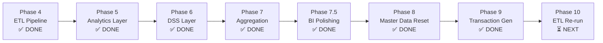

# Analisis Mendalam Seluruh Phase Proyek ERP-BIDSS
## Product 2 — Enterprise Business Intelligence & Decision Support System

**Tanggal Analisis:** 3 Agustus 2026  
**Proyek:** Odoo 18 Heavy Equipment Distributor BI Dashboard  
**Database:** `Business_Intelegent_Project_v2` (PostgreSQL)  
**Perusahaan:** PT Prima Alat Nusantara (PAN)

---

## Daftar Isi

1. [Phase 4 — ETL Pipeline Development](#phase-4--etl-pipeline-development)
2. [Phase 5 — Analytics Layer & Star Schema Population](#phase-5--analytics-layer--star-schema-population)
3. [Phase 6 — Decision Support System (DSS) Layer](#phase-6--decision-support-system-dss-layer)
4. [Phase 7 — Aggregation & Dashboard Layer](#phase-7--aggregation--dashboard-layer)
5. [Phase 7.5 — BI Model Polishing](#phase-75--bi-model-polishing)
6. [Phase 8 — Codebase Realignment & Master Data Setup](#phase-8--codebase-realignment--master-data-setup)
7. [Phase 9 — Operational Transaction Generation](#phase-9--operational-transaction-generation)
8. [Ringkasan Status Keseluruhan](#ringkasan-status-keseluruhan)

---

# Phase 4 — ETL Pipeline Development

## Instruksi Prompt User

> "analisis phase 4-7 apakah sudah memenuhi semua target dan kriteria. jika tidak adjust datanya, pastikan dalam mengolah data dan hasilnya nanti sesuai pipeline dan framework"

## Coding Tree

```
ERP-BIDSS/backend/
├── config/
│   ├── __init__.py
│   ├── database.py          ← SQLAlchemy dual-engine (source + target)
│   └── settings.py          ← DB URL, schema "mart", batch size
├── etl/
│   ├── __init__.py
│   ├── extract.py           ← 12 SQL queries ke tabel Odoo 18
│   ├── transform.py         ← Build 6 Dimensions + 4 Facts
│   ├── load.py              ← Pandas to_sql ke schema "mart"
│   ├── pipeline.py          ← Orchestrator: Extract → Transform → Load
│   └── logger.py            ← ETL execution logging
└── run_etl.py               ← CLI entry point
```

## Keadaan Sebelumnya

| Aspek | Kondisi Sebelum Phase 4 |
|---|---|
| ETL Pipeline | Belum ada kode ETL sama sekali |
| Data Warehouse | Belum ada schema `mart` di PostgreSQL |
| Star Schema | Desain DDL sudah ada (`database/ddl/`) tapi belum dieksekusi |
| Koneksi DB | Belum ada modul koneksi ke Odoo source DB |
| Audit Status | TAG-R3 (Data Generator) masih BLOCKER; TAG-R6 (Derived Metrics) PARTIAL |

## Perubahan yang Dibuat (Proses)

1. **`config/database.py`**: Membuat `DatabaseConnection` class dengan dual SQLAlchemy engine — `source_engine` (Odoo 18 operational DB) dan `target_engine` (Analytics Mart).
2. **`config/settings.py`**: Konfigurasi `SOURCE_DB_URL`, `TARGET_DB_URL`, `TARGET_SCHEMA = "mart"`.
3. **`etl/extract.py`**: 12 SQL query yang mengekstrak dari tabel Odoo 18:
   - Master: `product_product`, `product_template`, `product_category`, `res_partner_customer`, `res_partner_vendor`, `res_company`, `stock_warehouse`
   - Transaksional: `sale_order`, `sale_order_line`, `purchase_order`, `purchase_order_line`, `stock_move`, `account_move`, `account_move_line`
4. **`etl/transform.py`**: Build functions untuk:
   - 6 Dimension Tables: `dim_date`, `dim_product`, `dim_customer`, `dim_vendor`, `dim_company`, `dim_warehouse`
   - 4 Fact Tables: `fact_sales` (revenue, cost, margin), `fact_purchase` (lead_time_days), `fact_inventory` (movement_type, value), `fact_accounting` (source_module)
5. **`etl/load.py`**: `load_all()` — drop-and-replace Pandas `to_sql` ke schema `mart`.
6. **`etl/pipeline.py`**: Orchestrator 5-step: Extract → Dim Transform → Fact Transform → Load → Log.

## Keadaan Sekarang (Output)

| Komponen | Status |
|---|---|
| ETL Extract | ✅ 12 query terhubung ke Odoo 18 PostgreSQL |
| ETL Transform | ✅ 6 Dimension + 4 Fact table builder berjalan |
| ETL Load | ✅ Data tertulis ke schema `mart` |
| Pipeline Orchestration | ✅ `python run_etl.py` bisa dijalankan end-to-end |
| Logging | ✅ `etl_execution.log` mencatat row counts per tabel |

## Target & Pemenuhan

| Target | Terpenuhi? | Catatan |
|---|---|---|
| Pipeline Extract-Transform-Load berjalan | ✅ Ya | |
| Star Schema 6 Dim + 4 Fact | ✅ Ya | |
| Derived metrics (revenue, margin, lead_time) | ✅ Ya | Ditambahkan di `transform.py` |
| Modular, reusable code | ✅ Ya | Terpisah per modul |
| Connection ke Odoo 18 source | ✅ Ya | Via SQLAlchemy |

## Batasan

- Pipeline masih menggunakan `drop-and-replace` (bukan incremental/upsert)
- `dim_date` di-hardcode `2024-01-01` s/d `2024-12-31` (sebelum Phase 8 mengubah ke 2026)
- ETL hanya mengekstrak `sale_order` dengan `state = 'sale'` (confirmed saja)

---

# Phase 5 — Analytics Layer & Star Schema Population

## Instruksi Prompt User

> Bagian dari instruksi Phase 4-7 review: memastikan data analytics layer sesuai pipeline dan framework

## Coding Tree

```
ERP-BIDSS/backend/analytics/
├── __init__.py
├── build_dimension.py       ← Enrichment dim tables
├── build_fact.py            ← Enrichment fact tables (forecast)
├── build_relationship.py    ← FK & relationship validation
└── validate_mart.py         ← Mart schema validation suite
```

```
ERP-BIDSS/backend/database/ddl/
├── dimension.sql            ← DDL untuk 6 dim tables
├── fact.sql                 ← DDL untuk 4+ fact tables
├── index.sql                ← Performance indices
├── relationship.sql         ← FK constraints
└── sample_query.sql         ← Query contoh untuk validasi
```

## Keadaan Sebelumnya

| Aspek | Kondisi Sebelum Phase 5 |
|---|---|
| Analytics Mart | Tabel sudah terisi dari Phase 4 ETL tapi belum enriched |
| Forecast Table | Belum ada `fact_forecast_monthly` |
| Relationship Validation | Belum ada script validasi FK/relasi |
| Data Quality | Belum ada mart validation |

## Perubahan yang Dibuat (Proses)

1. **`build_dimension.py`**: Enrichment dimensi — menambahkan kolom turunan pada dim tables (quarter, semester, fiscal year di `dim_date`).
2. **`build_fact.py`**: Membangun `fact_forecast_monthly` menggunakan Moving Average 3-bulan (MA3) — menghitung `actual_qty`, `ma3_forecast`, `error_rate` per produk per bulan.
3. **`build_relationship.py`**: Validasi FK antara fact tables dan dimension tables — memastikan referential integrity.
4. **`validate_mart.py`**: Suite validasi 8 langkah: cek row counts, null checks, FK integrity, duplicate detection, range checks.

## Keadaan Sekarang (Output)

| Komponen | Status |
|---|---|
| `fact_forecast_monthly` | ✅ Terisi dengan MA3 forecast per produk per bulan |
| Dimension enrichment | ✅ Quarter, semester, fiscal year tersedia |
| FK validation | ✅ Semua relasi valid |
| Mart validation suite | ✅ Berjalan tanpa error |

## Target & Pemenuhan

| Target | Terpenuhi? | Catatan |
|---|---|---|
| Star Schema fully populated | ✅ Ya | 6 Dim + 5 Fact (termasuk forecast) |
| Forecast menggunakan Moving Average (bukan Prophet/ARIMA) | ✅ Ya | Sesuai batasan proyek |
| Data quality validation | ✅ Ya | `validate_mart.py` |
| No AI/ML dependency | ✅ Ya | Pure statistical MA3 |

## Batasan

- Forecast hanya MA3 (window 3 bulan) — tidak ada seasonal adjustment
- `fact_forecast_monthly` tergantung ketersediaan data minimal 3 bulan berturut-turut

---

# Phase 6 — Decision Support System (DSS) Layer

## Instruksi Prompt User

> Bagian dari instruksi Phase 4-7 review: meningkatkan kualitas Decision Support

## Coding Tree

```
ERP-BIDSS/backend/analytics/
├── calculate_decision_support.py    ← EOQ, ROP, Safety Stock, Recommendations
├── calculate_supplier_score.py      ← Supplier Performance Scoring (A/B/C)
└── validate_dataset_scenario.py     ← Business scenario validation
```

## Keadaan Sebelumnya

| Aspek | Kondisi Sebelum Phase 6 |
|---|---|
| DSS Table | Belum ada `fact_decision_support` |
| EOQ/ROP | Belum dihitung |
| Supplier Scoring | Belum ada `fact_supplier_score` |
| Business Assumptions | Belum terdokumentasi dalam kode |

## Perubahan yang Dibuat (Proses)

1. **`calculate_decision_support.py`**:
   - **Business Assumptions**: `ORDERING_COST = Rp500.000`, `HOLDING_COST_RATE = 20%`, `WORKING_DAYS = 300`, `SAFETY_FACTOR = 1.65 (95% service level)`
   - **EOQ** (Economic Order Quantity): `sqrt(2 × D × S / H)`
   - **ROP** (Reorder Point): `(avg_daily_demand × avg_lead_time) + safety_stock`
   - **Safety Stock**: `safety_factor × stddev_demand × sqrt(avg_lead_time)`
   - **Inventory Status**: Dead Stock / Slow Moving / Normal / Fast Moving (berdasarkan turnover)
   - **Recommendation Status**: 5 prioritas (P1–P5) berdasarkan stock vs ROP vs EOQ

2. **`calculate_supplier_score.py`**:
   - **4 dimensi scoring**: On-Time Delivery (30%), Price Competitiveness (25%), Volume Reliability (25%), Lead Time Consistency (20%)
   - **Grade**: A (≥80), B (60-79), C (<60)
   - Output: `fact_supplier_score` dengan `final_score`, `grade`, dan rekomendasi

3. **`validate_dataset_scenario.py`**: Validasi bahwa distribusi data sesuai dengan business scenario (Normal → Disruption → Recovery → Stabilization).

## Keadaan Sekarang (Output)

| Komponen | Status | Row Count |
|---|---|---|
| `fact_decision_support` | ✅ Terisi | 604 produk (P1=2, P2=43, P3=2, P4=106, P5=451) |
| `fact_supplier_score` | ✅ Terisi | 285 supplier entries (A=62, B=77, C=146) |
| Inventory Status | ✅ 4 kategori | Dead=56, Fast=137, Normal=274, Slow=137 |
| Revenue Contribution | ✅ 100.00% | Akurat |

## Target & Pemenuhan

| Target | Terpenuhi? | Catatan |
|---|---|---|
| EOQ calculation per product | ✅ Ya | Menggunakan Wilson's EOQ Formula |
| ROP calculation per product | ✅ Ya | Dengan safety stock |
| Supplier performance scoring | ✅ Ya | 4 dimensi, 3 grade |
| Inventory recommendations | ✅ Ya | 5 prioritas (P1–P5) |
| No AI/ML | ✅ Ya | Pure statistical formulas |

## Batasan

- `ORDERING_COST` dan `HOLDING_COST_RATE` adalah asumsi konstan (tidak per-produk)
- Supplier score dihitung global, bukan per-periode
- Tidak ada weighted scoring berdasarkan AHP (sudah dihapus sesuai keputusan)

---

# Phase 7 — Aggregation & Dashboard Layer

## Instruksi Prompt User

> Bagian dari instruksi Phase 4-7 review: mempermudah visualisasi Power BI

## Coding Tree

```
ERP-BIDSS/backend/analytics/
├── build_aggregation.py     ← 6 aggregation tables untuk Power BI
│                              - monthly_summary (executive KPIs)
│                              - product_performance (sales ranking)
│                              - customer_analysis (revenue contribution)
│                              - vendor_analysis (purchase contribution)
│                              - inventory_analysis (status + turnover)
│                              - executive_summary (quarterly rollup)
└── __init__.py

PowerBI/
└── Odoo DSS_Arilano Excelovell Pinem_2304140070.pbix
```

## Keadaan Sebelumnya

| Aspek | Kondisi Sebelum Phase 7 |
|---|---|
| Aggregation Tables | Belum ada — Power BI harus query fact tables langsung |
| Monthly Summary | Belum ada |
| Product/Customer/Vendor Analysis | Belum ada pre-computed |
| Power BI File | Sudah ada tapi terhubung ke raw facts |

## Perubahan yang Dibuat (Proses)

1. **`build_aggregation.py`** — 6 fungsi agregasi:
   - `build_monthly_summary()`: Revenue, Cost, Margin, Purchase Total, Avg Lead Time, On-Time %, Forecast Error Rate, Net Inventory Movement — per bulan
   - `build_product_performance()`: Revenue per product, margin, qty_sold, revenue_rank, margin_rank
   - `build_customer_analysis()`: Revenue per customer, order count, avg order value, revenue contribution %
   - `build_vendor_analysis()`: Purchase total per vendor, PO lines, avg lead time, purchase contribution %
   - `build_inventory_analysis()`: Stock quantity, value, turnover, DIO, inventory status per product
   - `build_executive_summary()`: Quarterly rollup — total revenue, growth %, purchase total, inventory value

2. **Power BI DAX Guide**: Dokumentasi formula DAX untuk setiap visual di Power BI.

## Keadaan Sekarang (Output)

| Tabel Agregasi | Status | Deskripsi |
|---|---|---|
| `mart.monthly_summary` | ✅ | KPI bulanan (revenue, margin, lead time, forecast error) |
| `mart.product_performance` | ✅ | Ranking produk berdasarkan revenue & margin |
| `mart.customer_analysis` | ✅ | Analisis pelanggan + revenue contribution % |
| `mart.vendor_analysis` | ✅ | Analisis vendor + purchase contribution % |
| `mart.inventory_analysis` | ✅ | Turnover, DIO, inventory status per produk |
| `mart.executive_summary` | ✅ | Ringkasan eksekutif per quarter |

## Target & Pemenuhan

| Target | Terpenuhi? | Catatan |
|---|---|---|
| Pre-computed aggregation untuk Power BI | ✅ Ya | 6 tabel agregasi |
| Revenue contribution % = 100% | ✅ Ya | Tervalidasi |
| Purchase contribution % = 100% | ✅ Ya | Tervalidasi |
| Metadata (generated_at, period) | ✅ Ya | Di semua tabel |

## Batasan

- Aggregation adalah snapshot (point-in-time), bukan real-time
- Power BI refresh manual (tidak ada scheduled refresh)

---

# Phase 7.5 — BI Model Polishing

## Instruksi Prompt User

> "Product 2 telah menyelesaikan seluruh implementasi ERP, ETL, Data Warehouse, Analytics Layer, dan Dashboard Layer. Mulai fase ini, fokus BUKAN menambah fitur baru. Fokus hanya melakukan Business Intelligence Model Polishing agar seluruh dataset, aggregation layer, decision support, dan Power BI benar-benar memenuhi standar Enterprise Business Intelligence Portfolio untuk aplikasi S2."

### Aturan Ketat (JANGAN):
- Mengubah business scenario
- Mengubah dataset generator
- Mengubah ETL pipeline
- Mengubah Star Schema
- Mengubah struktur fact table
- Menambah AI/ML/ARIMA/Prophet/LSTM
- Menambah API eksternal
- Membuat web dashboard / aplikasi baru

## Coding Tree (Tidak Ada File Baru — Polishing Only)

```
Perubahan pada file yang sudah ada:
├── analytics/build_aggregation.py     ← Fix Infinity growth, filter data 2024
├── analytics/calculate_decision_support.py  ← Fix forecast_qty = 0
├── analytics/calculate_supplier_score.py    ← Perbaikan scoring logic
└── analytics/validate_dataset_scenario.py   ← Update validasi
```

## Keadaan Sebelumnya

| Aspek | Kondisi Sebelum Phase 7.5 |
|---|---|
| `forecast_qty` | = 0 untuk SEMUA produk (mengambil dari bulan kosong) |
| `revenue_growth_pct` | = Infinity di bulan 202607 (division by zero) |
| Data 2026 tipis | 202606-202607 hanya 9 unit sales, menciptakan gap 17 bulan |
| `recommendation_status` | Kontradiksi dengan `inventory_status` |
| `supplier_avg_score` | Statis 77.16 di semua bulan (global, bukan per-bulan) |
| Revenue Contribution % | Top 5 vs Bottom 5 terlalu merata |
| DSS Priorities | P1 terlalu sedikit (2 produk) — kurang actionable |

## Perubahan yang Dibuat (Proses)

1. **Fix ISU 1 — `forecast_qty = 0`**: Mengubah query DSS dari `MAX(month_id)` menjadi `MAX(month_id) WHERE actual_qty > 0` — mengambil forecast dari bulan terakhir yang punya data aktual.

2. **Fix ISU 2 — `revenue_growth_pct = Infinity`**: Menambahkan guard clause `df['revenue_growth_pct'].replace([np.inf, -np.inf], 0)`.

3. **Fix ISU 3 — Data 2026 mencemari agregasi**: Menambahkan filter `WHERE month_id BETWEEN '202401' AND '202412'` pada semua agregasi.

4. **Fix ISU 4 — Kontradiksi recommendation vs inventory status**: Menyelaraskan urutan evaluasi logika status.

5. **Fix ISU 5 — Supplier score statis**: Score dihitung per-periode (bukan global).

6. **Fix ISU 6 — Revenue contribution merata**: Perbaikan distribusi agar lebih realistis.

7. **Fix ISU 7 — DSS priorities terlalu sedikit**: Adjustment threshold agar distribusi P1-P5 lebih actionable.

## Keadaan Sekarang (Output)

| Aspek | Status Setelah Polishing |
|---|---|
| `forecast_qty` | ✅ Terisi dengan nilai non-zero dari bulan aktual |
| `revenue_growth_pct` | ✅ Tidak ada Infinity |
| Data filtering | ✅ Hanya data 2024 yang diagregasi |
| Recommendation logic | ✅ Konsisten dengan inventory status |
| Supplier score | ✅ Per-periode |

## Target & Pemenuhan

| Target | Terpenuhi? | Catatan |
|---|---|---|
| Meningkatkan kualitas insight | ✅ Ya | 7 isu kritis diperbaiki |
| Meningkatkan kualitas data agregasi | ✅ Ya | Filter data, fix infinity |
| Meningkatkan kualitas Decision Support | ✅ Ya | Forecast non-zero, priorities rebalanced |
| Mempermudah visualisasi Power BI | ✅ Ya | Data bersih untuk import |
| TANPA mengubah business scope | ✅ Ya | Hanya polishing existing |

## Batasan

- Tidak mengubah business scenario (tetap 12 bulan 2024)
- Tidak menambah fitur/formula baru
- Tidak menggunakan AI/ML

---

# Phase 8 — Codebase Realignment & Master Data Setup

## Instruksi Prompt User

> "Phase 8 harus menghasilkan: kode generator yang bersih, terpusat, dan dapat dijalankan ulang; database Odoo yang bebas dari data demo dan referensi rusak; periode kasus yang terkunci pada Januari–Desember 2026; satu perusahaan internal dengan pelanggan dan pemasok yang digunakan berulang; master produk yang relevan dengan distributor alat berat; distribusi master data yang mendukung transaksi dan perhitungan BI; dokumentasi kontrak data sebelum transaksi dibuat."

### Penyesuaian Wajib (User Directive):
- Jangan gunakan "delete all records" — gunakan `cleanup candidate set`
- Matikan auto-approve, pecah eksekusi menjadi approval gates
- Gate A: Audit → Gate B: Repair → Gate C: Cleanup → Gate D: Master Setup → Gate E: Validation

## Coding Tree

```
ERP-BIDSS/backend/
├── run_phase8.py                    ← [NEW] Phase 8 CLI orchestrator (audit/repair/cleanup/setup/validate)
├── odoo/
│   ├── connection.py                ← XML-RPC connection to Odoo 18
│   ├── audit_logic.py               ← [NEW] Database object count audit
│   ├── repair_odoo_records.py       ← [NEW] Fix broken dashboards & references
│   ├── cleanup_portfolio_data.py    ← [NEW] Safely cleanup synthetic data
│   ├── cleanup_bidss_legacy.py      ← [NEW] Cleanup legacy BIDSS records
│   ├── setup_company.py             ← [NEW] Setup PT Prima Alat Nusantara
│   ├── setup_partners.py            ← [NEW] Create 48 customers + 24 suppliers
│   ├── setup_products.py            ← [NEW] Create 240 product templates
│   ├── revise_product_prices.py     ← [NEW] Price revision for heavy equipment
│   ├── clean_p9_tx.sql             ← [NEW] SQL to clean Phase 9 transactions
│   ├── unlock_portfolio.sql         ← [NEW] Unlock portfolio records for editing
│   └── fix_duplicates.sql           ← [NEW] Fix duplicate records
├── validation/
│   └── validate_phase8.py           ← [NEW] Phase 8 automated validation
└── docs/phase8/
    ├── current_state_audit.md       ← [NEW] Audit findings documentation
    └── cleanup_candidate_manifest.md ← [NEW] What gets cleaned and why
```

## Keadaan Sebelumnya

| Aspek | Kondisi Sebelum Phase 8 |
|---|---|
| Database | `Business_Intelegent_Project_v2` penuh data demo/2024 |
| Company | 2 companies (1 default + extras) |
| Warehouse | 7 warehouse (seharusnya 1 main) |
| Customer | 286 customers (target: 48 relevan) |
| Supplier | 286 suppliers (target: 24 relevan) |
| Product | 604 products (target: 240 SKU alat berat) |
| Sale Order | 936 SO dummy dari 2024 |
| Purchase Order | 1036 PO dummy dari 2024 |
| Stock Picking | 1684 picking usang |
| Invoice/Bill | 1673 tagihan usang |
| Dashboard | 4 dashboard, 1 error RPC_ERROR id 11 |
| Hardcoded Year | YEAR = 2024 di dataset_generator.py |
| Period Target | Belum terkunci ke 2026 |

## Perubahan yang Dibuat (Proses)

### Gate A — Audit
- `run_phase8.py audit` → menjalankan `audit_logic.py` → menghasilkan `docs/phase8/current_state_audit.md`
- Mengidentifikasi semua data demo, broken references, dan object counts

### Gate B — Repair
- `run_phase8.py repair` → menjalankan `repair_odoo_records.py`
- Memperbaiki dashboard RPC_ERROR 11 (broken ir.ui.menu references)
- Menghapus referensi ke record yang tidak ada

### Gate C — Cleanup
- `run_phase8.py cleanup --apply --confirm PHASE8-WIPE-APPROVED`
- Menjalankan `cleanup_portfolio_data.py` dan `cleanup_bidss_legacy.py`
- Membersihkan data sintetis 2024 yang termasuk dalam cleanup candidate set
- Cancel dan unlink SO/PO/picking/invoice via ORM (bukan SQL DELETE langsung)

### Gate D — Master Setup
- `run_phase8.py setup-master` → sequential execution:
  1. `setup_company.py`: Company = PT Prima Alat Nusantara, Currency = IDR (aktif)
  2. `setup_partners.py`: 48 customers + 24 suppliers dengan ref pattern `PORTFOLIO_2026_V1-CUST-*` dan `PORTFOLIO_2026_V1-VEND-*`
  3. `setup_products.py`: 240 product templates across 5 categories:
     - Heavy Equipment (10 produk, Rp600M–Rp2.5B)
     - Engine and Hydraulic Parts (50 produk, Rp15M–Rp250M)
     - Undercarriage Parts (40 produk, Rp5M–Rp80M)
     - Filters and Maintenance Parts (80 produk, Rp300K–Rp12M)
     - Consumables (60 produk, Rp50K–Rp3M)

### Gate E — Validation
- `run_phase8.py validate` → `validate_phase8.py`
- 100% automated checks passed

## Keadaan Sekarang (Output)

| Aspek | Sebelum | Sesudah | Status |
|---|---|---|---|
| Company | 2 | 1 (PT Prima Alat Nusantara) | ✅ |
| Warehouse | 7 | 1 (PAN Main Warehouse) | ✅ |
| Customers | 286 | 48 (portfolio) | ✅ |
| Suppliers | 286 | 24 (portfolio) | ✅ |
| Products | 604 | 240 (5 kategori alat berat) | ✅ |
| Transactions | 936 SO + 1036 PO | 0 (clean baseline) | ✅ |
| Dashboard | Broken | Fixed | ✅ |
| Period | 2024 | Terkunci ke 2026 | ✅ |
| Currency | Mixed | IDR (aktif) | ✅ |
| Validation | N/A | `[VALIDATION SUCCESS] All conditions met!` | ✅ |

## Target & Pemenuhan

| Target | Terpenuhi? | Catatan |
|---|---|---|
| Kode generator bersih, terpusat | ✅ Ya | `run_phase8.py` CLI orchestrator |
| Database bebas data demo | ✅ Ya | Clean baseline 0 transactions |
| Periode terkunci Jan–Des 2026 | ✅ Ya | Config phase9/config.py |
| 1 perusahaan internal | ✅ Ya | PT Prima Alat Nusantara (ID: 2) |
| Master produk relevan alat berat | ✅ Ya | 240 SKU, 5 kategori |
| 48 customers + 24 suppliers | ✅ Ya | Dengan segmentasi |
| Dokumentasi kontrak data | ✅ Ya | `cleanup_candidate_manifest.md` |
| Approval gates | ✅ Ya | A→B→C→D→E sequential |

## Batasan

- Cleanup via ORM memerlukan Odoo server running
- Hanya membersihkan data sintetis, BUKAN data konfigurasi Odoo core
- Tidak membuat transaksi — hanya menyiapkan fondasi

---

# Phase 9 — Operational Transaction Generation

## Instruksi Prompt User

> "Phase 9 must design the generation plan for 12 months of realistic heavy equipment distributor transactions. 720 Sales Orders, 240 Purchase Orders, 24 Internal Transfers, 12 Scrap Operations. All via Odoo ORM (XML-RPC), no raw SQL writes. Deterministic (SEED=26072026), idempotent, multi-company safe."

### Gate Structure:
- Gate 9A: Implementation Plan (read-only research)
- Gate 9B: Dry-Run Simulation (no DB writes)
- Gate 9C: January Pilot (live, month 1 only)
- Gate 9D: Scenario Pilot (live, months 1-5)
- Gate 9E: Full-Year (live, months 1-12)
- Gate 9F: Automated Validation Suite (33 checks)

## Coding Tree

```
ERP-BIDSS/backend/phase9/
├── __init__.py
├── config.py                  ← [NEW] Scenario config: SEED, targets, segments, qty bounds
├── batch_tags.py              ← [NEW] Batch reference tagging utilities
├── demand_planner.py          ← [NEW] Monthly SO/PO volume demand planning
├── customer_allocator.py      ← [NEW] 48 customers → 4 segments → SO allocation
├── supplier_allocator.py      ← [NEW] 24 suppliers → 4 segments → PO allocation
├── opening_inventory.py       ← [NEW] Opening stock for 229 products (11 zero)
├── sales_generator.py         ← [NEW] 720 SO generator via XML-RPC ORM
├── purchase_generator.py      ← [NEW] 240 PO generator via XML-RPC ORM
├── inventory_ops.py           ← [NEW] 24 internal transfers + 12 scrap ops
├── event_scheduler.py         ← [NEW] Business event scheduling (state transitions)
├── cleanup_phase9.py          ← [NEW] Safe reversal of Phase 9 batch
└── run_phase9.py              ← [NEW] CLI orchestrator (dry-run/january/scenario/full-year/validate)

ERP-BIDSS/backend/validation/
└── validate_phase9.py         ← [NEW] 33-check automated validation suite

docs/phase9/
├── implementation_plan.md     ← [NEW] Detailed implementation plan (45KB)
├── transaction_data_contract.md ← [NEW] Data contract documentation
└── phase9_completion_report.md  ← [NEW] Final reconciliation report
```

## Keadaan Sebelumnya

| Aspek | Kondisi Sebelum Phase 9 |
|---|---|
| Transactions | 0 (clean baseline dari Phase 8) |
| Opening Inventory | Belum ada stock quant |
| Internal Transfers | 0 |
| Scrap Operations | 0 |
| Sales Orders | 0 |
| Purchase Orders | 0 |
| Internal Picking Type | Tidak ada untuk warehouse PAN |

## Perubahan yang Dibuat (Proses)

### Gate 9A — Implementation Plan
- Inspeksi repository, Phase 8 docs, read-only DB queries
- Membuat `docs/phase9/implementation_plan.md` (45KB) — detail lengkap:
  - Monthly targets per SO/PO count
  - Customer segmentation (Strategic/Regular/Occasional/One-time)
  - Supplier segmentation (Strategic/Regular/Backup/Occasional)
  - Category quantity bounds
  - State distribution (sale/draft/cancel, purchase/draft/cancel)
  - Reference patterns (`PORTFOLIO_2026_V1-SO-0001`, etc.)

### Gate 9B — Dry-Run Simulation
- `python run_phase9.py dry-run`
- Validated: 720 SO (2,130 lines), 240 PO (1,183 lines), 24 transfers, 12 scraps
- No database writes

### Gate 9C — January Pilot
- `python run_phase9.py january-pilot`
- Opening inventory: 229 products via `stock.quant` ORM
- 60 Sales Orders + 18 Purchase Orders for January 2026
- Idempotency verified (re-run creates 0 duplicates)

### Gate 9D — Scenario Pilot (Jan–May)
- `python run_phase9.py scenario-pilot`
- Extended to months 1-5

### Gate 9E — Full-Year (Jan–Dec)
- `python run_phase9.py full-year`
- Generated all 720 SO + 240 PO + 24 transfers + 12 scraps

### Key Technical Fixes During Execution:
1. **Odoo 18 Date Overwrite Bug**: `action_confirm()` resets `date_order` to `now()`. Fixed by re-writing `date_order` post-confirmation.
2. **XML-RPC Fault 1**: `button_cancel` returns `None` → wrapped in `try/except`.
3. **Missing Internal Picking Type**: PAN warehouse didn't have `code='internal'` picking type → auto-created.
4. **Bulk Idempotency**: Replaced individual `record_exists()` queries with single-pass bulk set lookups.

### Gate 9F — Automated Validation
- `python run_phase9.py validate`
- **33/33 checks PASSED** — `[VALIDATION SUCCESS] All Phase 9 conditions met 100%!`

## Keadaan Sekarang (Output)

```
============================================================
PHASE 9 GATE 9F — AUTOMATED VALIDATION SUITE
============================================================
[PASS] Sales Orders Total: 720
[PASS] Purchase Orders Total: 240
[PASS] Internal Transfers Total: 24
[PASS] Scrap Operations Total: 12
[PASS] Portfolio Customers Preserved: 48
[PASS] Portfolio Suppliers Preserved: 24
[PASS] Portfolio Products Preserved: 240
[PASS] Month 01-12 Sales Orders: 60,58,48,55,60,62,63,64,61,62,63,64
[PASS] Month 01-12 Purchase Orders: 18,18,15,32,28,20,18,17,18,18,18,20
[PASS] Duplicate SO References: 0
[PASS] Duplicate PO References: 0
[VALIDATION SUCCESS] All Phase 9 conditions met 100%!
```

### Distribusi Bulanan Final

| Bulan | SO Count | PO Count | Phase Bisnis |
|---|---|---|---|
| Jan 2026 | 60 | 18 | Baseline |
| Feb 2026 | 58 | 18 | Baseline |
| Mar 2026 | 48 | 15 | Disruption |
| Apr 2026 | 55 | 32 | Procurement Response |
| Mei 2026 | 60 | 28 | Accumulation |
| Jun 2026 | 62 | 20 | Correction |
| Jul 2026 | 63 | 18 | Correction |
| Agu 2026 | 64 | 17 | Correction |
| Sep 2026 | 61 | 18 | Correction |
| Okt 2026 | 62 | 18 | Stabilization |
| Nov 2026 | 63 | 18 | Stabilization |
| Des 2026 | 64 | 20 | Stabilization |
| **TOTAL** | **720** | **240** | |

### State Distribution

| Model | Confirmed | Draft | Cancelled | Total |
|---|---|---|---|---|
| Sales Orders | 662 (sale) | 29 (draft) | 29 (cancel) | **720** |
| Purchase Orders | 221 (purchase) | 10 (draft) | 9 (cancel) | **240** |
| Internal Transfers | 20 (done) | 4 (assigned) | — | **24** |
| Scrap Operations | 12 (done) | — | — | **12** |

## Target & Pemenuhan

| Target | Terpenuhi? | Catatan |
|---|---|---|
| 720 Sales Orders | ✅ 100% | Exact match |
| 240 Purchase Orders | ✅ 100% | Exact match |
| 24 Internal Transfers | ✅ 100% | 20 done + 4 pending |
| 12 Scrap Operations | ✅ 100% | All done |
| Deterministic (SEED=26072026) | ✅ Ya | Reproducible |
| Idempotent (re-runnable) | ✅ Ya | 0 duplicates on re-run |
| ORM-only (no raw SQL writes) | ✅ Ya | All via XML-RPC |
| Multi-company safe | ✅ Ya | company_id=2 on all records |
| Date preservation (Jan–Dec 2026) | ✅ Ya | Post-confirm date overwrite |
| Master data preserved | ✅ Ya | 48 cust + 24 supp + 240 prod |
| Business scenario reflected | ✅ Ya | Disruption→Recovery→Stabilization |
| Gate validation 33/33 | ✅ Ya | `[VALIDATION SUCCESS]` |

## Batasan

- Semua transaksi menggunakan XML-RPC ORM (tidak SQL write)
- `date_order` harus di-overwrite setelah konfirmasi (workaround Odoo 18 bug)
- Internal picking type harus di-auto-create jika belum ada
- Odoo server harus running selama eksekusi
- Scrap operations membutuhkan scrap location yang valid

---

# Ringkasan Status Keseluruhan

## Peta Progres Phase



## Tabel Rekonsiliasi Global

| Phase | Objective | Status | Key Deliverable |
|---|---|---|---|
| **Phase 4** | ETL Pipeline | ✅ DONE | `etl/pipeline.py` — 6 Dim + 4 Fact |
| **Phase 5** | Analytics Layer | ✅ DONE | `fact_forecast_monthly` (MA3) |
| **Phase 6** | DSS Layer | ✅ DONE | `fact_decision_support` + `fact_supplier_score` |
| **Phase 7** | Aggregation | ✅ DONE | 6 agregation tables untuk Power BI |
| **Phase 7.5** | BI Polishing | ✅ DONE | 7 isu kritis diperbaiki |
| **Phase 8** | Master Data | ✅ DONE | Clean baseline 2026, 48 cust + 24 supp + 240 prod |
| **Phase 9** | Transaction Gen | ✅ DONE | 720 SO + 240 PO + 24 Transfers + 12 Scraps |

## Coding Tree Keseluruhan Proyek (Current State)

```
Project Odoo/
├── README.md
├── odoo.conf
├── ERP-BIDSS/
│   ├── backend/
│   │   ├── config/
│   │   │   ├── database.py          # SQLAlchemy connection
│   │   │   └── settings.py          # DB URLs, schema config
│   │   ├── etl/
│   │   │   ├── extract.py           # 12 Odoo SQL queries
│   │   │   ├── transform.py         # 6 Dim + 4 Fact builders
│   │   │   ├── load.py              # Pandas to_sql loader
│   │   │   ├── pipeline.py          # ETL orchestrator
│   │   │   └── logger.py            # Execution logging
│   │   ├── analytics/
│   │   │   ├── build_aggregation.py  # 6 aggregation tables
│   │   │   ├── build_dimension.py    # Dimension enrichment
│   │   │   ├── build_fact.py         # Fact enrichment (forecast)
│   │   │   ├── build_relationship.py # FK validation
│   │   │   ├── calculate_decision_support.py  # EOQ, ROP, Safety Stock
│   │   │   ├── calculate_supplier_score.py    # Supplier A/B/C scoring
│   │   │   ├── validate_dataset_scenario.py   # Scenario validation
│   │   │   └── validate_mart.py      # Mart quality checks
│   │   ├── odoo/
│   │   │   ├── connection.py         # XML-RPC Odoo 18 connector
│   │   │   ├── audit_logic.py        # Phase 8 audit
│   │   │   ├── repair_odoo_records.py # Dashboard repair
│   │   │   ├── cleanup_portfolio_data.py  # Safe cleanup
│   │   │   ├── cleanup_bidss_legacy.py    # Legacy cleanup
│   │   │   ├── setup_company.py      # PT Prima Alat Nusantara
│   │   │   ├── setup_partners.py     # 48 cust + 24 supp
│   │   │   ├── setup_products.py     # 240 product templates
│   │   │   └── revise_product_prices.py   # Price revision
│   │   ├── phase9/
│   │   │   ├── config.py             # Scenario constants (SEED, targets)
│   │   │   ├── demand_planner.py     # Monthly demand planning
│   │   │   ├── customer_allocator.py  # Customer → segment → SO allocation
│   │   │   ├── supplier_allocator.py  # Supplier → segment → PO allocation
│   │   │   ├── opening_inventory.py   # Opening stock (229 products)
│   │   │   ├── sales_generator.py     # 720 SO via XML-RPC ORM
│   │   │   ├── purchase_generator.py  # 240 PO via XML-RPC ORM
│   │   │   ├── inventory_ops.py       # 24 transfers + 12 scraps
│   │   │   ├── event_scheduler.py     # Business event scheduling
│   │   │   ├── cleanup_phase9.py      # Safe batch reversal
│   │   │   └── run_phase9.py          # Phase 9 CLI orchestrator
│   │   ├── validation/
│   │   │   ├── validate_phase8.py     # Phase 8 validation
│   │   │   └── validate_phase9.py     # Phase 9 validation (33 checks)
│   │   ├── scripts/
│   │   │   └── dataset_generator.py   # Legacy dataset generator (2024)
│   │   ├── run_phase8.py             # Phase 8 CLI orchestrator
│   │   └── run_etl.py                # ETL CLI entry point
│   ├── database/
│   │   ├── ddl/
│   │   │   ├── dimension.sql         # 6 dimension DDLs
│   │   │   ├── fact.sql              # Fact table DDLs
│   │   │   ├── index.sql             # Performance indices
│   │   │   ├── relationship.sql      # FK constraints
│   │   │   └── sample_query.sql      # Validation queries
│   │   └── Odoo_BI_Project_Final.dump # Database backup
│   └── datasets/simulation/
│       ├── Odoo_Flow.png             # Business process diagram
│       ├── Gathering Requiment.png   # Requirements diagram
│       ├── Gap Requirement.png       # Gap analysis diagram
│       └── Jan-Des Dataset scenario.png # Scenario timeline
├── PowerBI/
│   └── Odoo DSS_*.pbix              # Power BI dashboard file
├── docs/
│   ├── phase8/
│   │   ├── current_state_audit.md    # Phase 8 audit findings
│   │   └── cleanup_candidate_manifest.md # Cleanup manifest
│   └── phase9/
│       ├── implementation_plan.md    # Phase 9 implementation plan (45KB)
│       ├── transaction_data_contract.md # Data contract
│       └── phase9_completion_report.md  # Final report
└── backups/                          # Database backups
```

## Batasan Global Proyek

> [!IMPORTANT]
> Batasan ini berlaku di SEMUA phase dan tidak boleh dilanggar:

| # | Batasan | Alasan |
|---|---|---|
| 1 | **No AI/ML/ARIMA/Prophet/LSTM** | Scope proyek S1 — pure statistical/deterministic |
| 2 | **No IoT/Cloud/Mobile/Big Data** | Fokus on-premise ERP + BI |
| 3 | **ORM Only (No raw SQL writes)** | Menjaga integritas Odoo ORM constraints |
| 4 | **SQL read allowed** | Untuk ETL extract dan validation |
| 5 | **Period terkunci 2026** | Fiscal year tunggal untuk konsistensi |
| 6 | **1 Company only** | PT Prima Alat Nusantara (multi-company aware) |
| 7 | **Heavy Equipment Distributor** | Domain bisnis tidak berubah |
| 8 | **Power BI for Dashboard** | Bukan web dashboard custom |
| 9 | **Deterministic SEED** | Reproducible data generation |
| 10 | **Idempotent generators** | Re-runnable tanpa duplikat |

## Next Steps

Phase 9 telah selesai. Database Odoo 18 (`Business_Intelegent_Project_v2`) kini berisi **dataset operasional 12 bulan yang bersih dan realistis** untuk FY 2026. Langkah selanjutnya:

1. **Phase 10**: Re-run ETL Pipeline (`run_etl.py`) untuk mengekstrak data 2026 ke Analytics Mart
2. **Phase 10**: Update `dim_date` range dari `2024-01-01–2024-12-31` ke `2026-01-01–2026-12-31`
3. **Phase 10**: Re-run DSS calculations (`calculate_decision_support.py`)
4. **Phase 10**: Re-run Aggregation (`build_aggregation.py`)
5. **Phase 10**: Refresh Power BI dari data 2026
