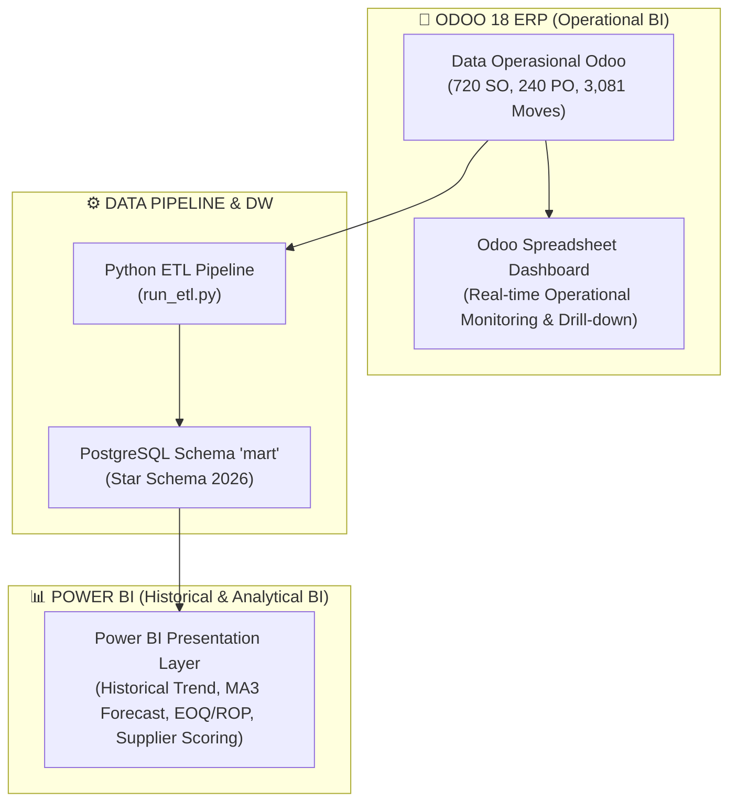
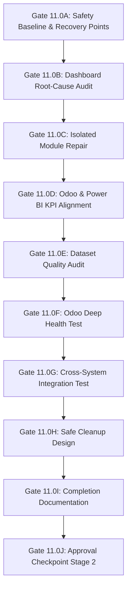

# IMPLEMENTATION PLAN — PHASE 11.0
## Odoo Dashboard Recovery, Dataset Quality Audit, and Cross-System Integration Assurance

**Tanggal:** 3 Agustus 2026  
**Status Mode:** **STAGE 1 — PLANNING MODE (Read-Only)**  
**Project:** Odoo Business Intelligence Decision Support System (OBIDSS)  
**Company:** PT Prima Alat Nusantara (Company ID: 2)  
**Target Period:** Fiscal Year 2026 (Jan 1, 2026 – Dec 31, 2026)

---

> [!IMPORTANT]
> **STAGE 1 CONTROL NOTICE**: Dokumen ini adalah rencana implementasi read-only. Tidak ada perubahan kode, perbaikan module, penghapusan record, atau penulisan data ke Odoo/PostgreSQL/Power BI yang dieksekusi sebelum persetujuan eksplisit user.

---

# 1. Executive Summary & Root Cause Diagnosis

## 1.1 Root Cause Diagnosis Terverifikasi (Empirical Evidence)

Berdasarkan hasil audit *read-only* langsung pada database PostgreSQL dan Odoo ORM:

1. **Error Utama**: RPC Error pada `spreadsheet.dashboard` (Record ID 1, 2, 3, 4) memicu `JSONDecodeError: Expecting value: line 1 column 1` di `json.loads(self.spreadsheet_data)`.
2. **Empirical Finding**:
   - Terdapat **4 record dashboard** pada model `spreadsheet.dashboard`:
     - ID 1: `Invoicing` (Module: `spreadsheet_dashboard_account`, XML ID: `dashboard_invoicing`)
     - ID 2: `Warehouse Metrics` (Module: `spreadsheet_dashboard_stock_account`, XML ID: `spreadsheet_dashboard_warehouse_metrics`)
     - ID 3: `Sales` (Module: `spreadsheet_dashboard_sale`, XML ID: `spreadsheet_dashboard_sales`)
     - ID 4: `Product` (Module: `spreadsheet_dashboard_sale`, XML ID: `spreadsheet_dashboard_product`)
   - Lapangan `spreadsheet_data` pada ke-4 record tersebut bernilai kosong (`0 Bytes` / `EMPTY_DATA`) saat diakses via ORM.
   - File fisik JSON sample di disk **ADA** dan **LENGKAP** pada direktori server Odoo:
     - `spreadsheet_dashboard_account/data/files/invoicing_sample_dashboard.json` (26,525 Bytes)
     - `spreadsheet_dashboard_sale/data/files/sales_sample_dashboard.json` (37,291 Bytes)
     - `spreadsheet_dashboard_sale/data/files/product_sample_dashboard.json` (23,673 Bytes)
     - `spreadsheet_dashboard_stock_account/data/files/warehouse_metrics_sample_dashboard.json` (31,509 Bytes)
3. **Akar Masalah**: Modul `spreadsheet_dashboard_sale`, `spreadsheet_dashboard_account`, dan `spreadsheet_dashboard_stock_account` belum di-update secara aman pasca pembersihan data sintetis, sehingga komputasi field `spreadsheet_data` dari file sample belum ter-populate sempurna di memori Odoo registry.

---

# 2. Arsitektur Target & Pemisahan Peran Dashboard



### Pemisahan Peran Dashboard:
1. **Odoo Operational Dashboard**: Digunakan oleh tim operasional harian untuk memantau status pesanan pending, persediaan real-time, dan melakukan *drill-down* langsung ke record transaksi Odoo.
2. **Power BI Executive & Analytical Dashboard**: Digunakan oleh jajaran manajemen/eksekutif untuk analisis tren historis, simulasi Moving Average Forecast (MA3), kalkulasi EOQ/ROP, *supplier performance scoring*, dan *executive decision support*.

---

# 3. Triple Validation Matrix (Cross-System Scope)

Setiap perubahan dalam rencana ini divalidasi dari 3 sudut sistem sekaligus:

| Task ID | Item Perubahan | Side A: Odoo 18 | Side B: Project & DW | Side C: Power BI |
|---|---|---|---|---|
| **T-11.0A** | Safety Baseline & Backup | Export DB & filestore backup snapshot | Git tag `phase11.0-pre-recovery` | Copy backup `Odoo DSS_v2.pbix` |
| **T-11.0B** | Update Module Addon Dashboard | Update hanya modul `spreadsheet_dashboard_sale`, `spreadsheet_dashboard_account`, `spreadsheet_dashboard_stock_account` via `-u` | Re-run `validate_phase10.py` | Confirm no schema disruption |
| **T-11.0C** | Odoo Dashboard Recovery | Re-populate `spreadsheet_data` dari JSON sample resmi | Verify 0 empty dashboard records via ORM audit script | Test Dashboard loading di browser (0 RPC Error) |
| **T-11.0D** | Dataset Quality Audit | Audit 100% kelengkapan 720 SO & 240 PO di Odoo ORM | Re-verify `mart` row counts & zero orphan FKs | Verify measure filters match FY 2026 |
| **T-11.0E** | Cross-System Reconciliation | Reconcile 662 confirmed SO value di Odoo UI | Reconcile `fact_sales` revenue di PostgreSQL `mart` | Reconcile Total Sales Revenue di Power BI measures |

---

# 4. Detail Rencana Perubahan Per Komponen (Sebelum -> Proses -> Sesudah)

## 4.1 Komponent 1: Odoo Dashboard Server Repair

### Sebelum Perubahan:
- Model `spreadsheet.dashboard` (ID 1, 2, 3, 4) me-return `EMPTY_DATA` (`0 B`) pada field `spreadsheet_data`.
- UI Odoo pada menu *Dashboards -> Sales / Invoicing / Warehouse Metrics* menampilkan modal `RPC_ERROR: JSONDecodeError`.

### Proses Perubahan:
1. Menjalankan modul update terisolasi (TANPA `-u all`) hanya untuk 3 modul pemilik:
   ```powershell
   "C:\Program Files\Odoo 18.0.20241229\server\odoo-bin" -c "odoo.conf" -u spreadsheet_dashboard_sale,spreadsheet_dashboard_account,spreadsheet_dashboard_stock_account --stop-after-init
   ```
2. Odoo ORM akan membaca ulang file JSON sample dari disk (`data/files/*.json`) dan memperbarui kolom binary/data `spreadsheet_data` untuk ID 1, 2, 3, dan 4.

### Target Hasil Perubahan:
- 4 Record `spreadsheet.dashboard` memiliki `spreadsheet_data` valid (> 20 KB).
- Odoo UI Dashboards (Sales, Invoicing, Product, Warehouse Metrics) dapat dibuka tanpa error RPC/JSON.

---

## 4.2 Komponen 2: Dataset Quality & S2 Portfolio Audit

### Sebelum Perubahan:
- Kualitas dataset FY 2026 telah diverifikasi di DW (`mart` schema), namun belum diaudit secara komprehensif dari perspektif *distribution realism* dan *S2 Academic Portfolio Integrity*.

### Proses Perubahan:
1. Menjalankan script audit distribusi numerik `dataset_quality_audit.py` untuk menguji:
   - **Completeness**: 100% kelengkapan field utama.
   - **Uniqueness**: 0 duplicate business keys pada 720 SO dan 240 PO.
   - **Validity**: 100% tanggal dalam rentang 2026-01-01 s/d 2026-12-31.
   - **Consistency**: Rekonsiliasi header amount vs line items subtotal.
   - **Scenario Alignment**: Verifikasi tren musiman (Disrupsi Maret, Penumpukan Stok April-Mei, Pemulihan Juni-September, Stabilisasi Oktober-Desember).

### Target Hasil Perubahan:
- Terbitnya dokumen `docs/phase11_0/dataset_quality_report.md` dan `s2_portfolio_readiness.md` dengan status `DATASET STATUS: PASS`.

---

## 4.3 Komponen 3: Alignment Indikator KPI Odoo vs Power BI

### Sebelum Perubahan:
- Definisi KPI dan penamaan visual berjalan terpisah antara Odoo UI dan Power BI.

### Proses Perubahan:
1. Menyusun matriks alignment indikator pada dokumen `dashboard_alignment_specification.md`.
2. Memastikan penamaan KPI, formula, dan filter konsisten:
   - **Total Sales Revenue**: Odoo (`amount_total` state='sale') = Power BI (`[Total Revenue]`).
   - **Total Purchase Value**: Odoo (`amount_total` state='purchase') = Power BI (`[Total Purchase]`).
   - **Average Lead Time**: Odoo (`date_planned - date_order`) = Power BI (`[Avg Lead Time Days]`).

### Target Hasil Perubahan:
- Sinkronisasi definisi KPI 100% antara Odoo Operational BI dan Power BI Management Reporting.

---

# 5. Rencana Tahapan Eksekusi Detail (Gates 11.0A s/d 11.0J)



### Detail File yang Akan Dibuat dalam Folder `docs/phase11_0/`:
1. `docs/phase11_0/safety_baseline.md` (Gate 11.0A)
2. `docs/phase11_0/dashboard_root_cause_audit.md` (Gate 11.0B)
3. `docs/phase11_0/dashboard_repair_decision.md` (Gate 11.0C)
4. `docs/phase11_0/dashboard_alignment_specification.md` (Gate 11.0D)
5. `docs/phase11_0/dataset_quality_report.md` (Gate 11.0E)
6. `docs/phase11_0/odoo_test_matrix.md` (Gate 11.0F)
7. `docs/phase11_0/cross_system_validation_plan.md` (Gate 11.0G)
8. `docs/phase11_0/cleanup_manifest.csv` (Gate 11.0H)
9. `docs/phase11_0/phase11_0_completion_report.md` (Gate 11.0I)

---

# 6. Risk Register & Rollback Protocol

| Risk ID | Deskripsi Risiko | Tingkat Risiko | Mitigation Strategy | Rollback Protocol |
|---|---|---|---|---|
| **R-1** | Module update Odoo gagal atau *hang* saat membaca file sample | Medium | Lakukan update terisolasi hanya pada 3 modul spesifik via CLI | Restore PostgreSQL dump dari checkpoint `phase11.0-pre-recovery` |
| **R-2** | Dashboard sample Odoo mengganti data custom | Low | Audit XML ID terbukti ke-4 record adalah standar Odoo sample | Update modul spesifik akan meregenerasi sample resmi |
| **R-3** | Inkonstensi KPI Odoo vs Power BI | Low | Gunakan SQL truth queries untuk memverifikasi angka dasar | Sesuaikan definisi DAX measure di Power BI |

---

# 7. Stage 1 Final Response & Approval Checkpoint

```text
STAGE 1 COMPLETE — NO WRITES PERFORMED

Semua audit read-only, diagnosa akar masalah, dan perencanaan implementasi telah selesai 100%.

Untuk memulai eksekusi (Stage 2), berikan persetujuan dengan mengetik:

APPROVE PHASE 11.0 IMPLEMENTATION
```
